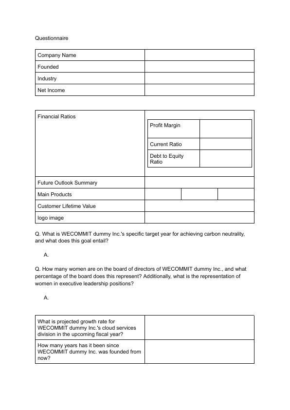
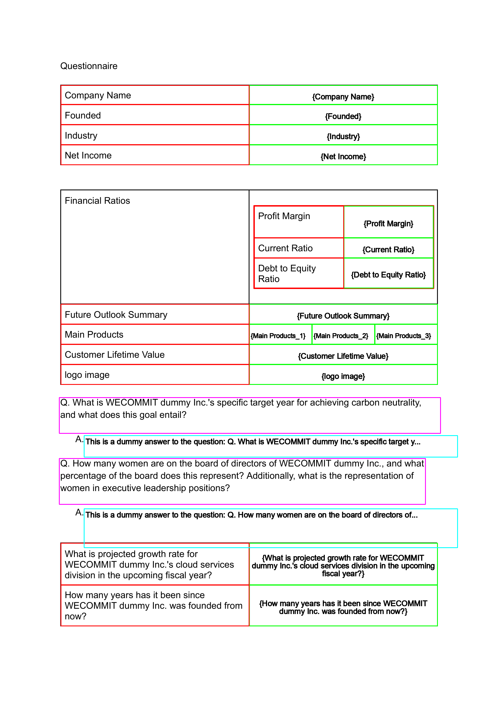
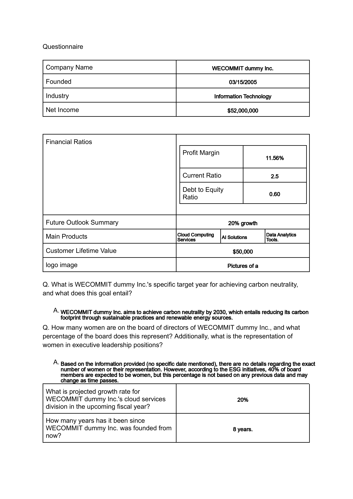

# AI PDF Filler: Technical Documentation

## Overview

AI PDF Filler is an application that automatically fills PDF forms using AI-powered text generation and image processing techniques. This document provides an in-depth explanation of the approaches and algorithms used in the project.

## Key Components

1. PDF Processing (pdf_utils.py)
2. Image Processing (image_processing.py)
3. AI Text Generation (ollama_utils.py)
4. Web Interface (app.py)

## 1. PDF Processing

The PDF processing module uses PyMuPDF (fitz) to convert PDF pages to images and vice versa. This allows us to work with the PDF content as images, which is crucial for our form field detection approach.

Key functions:
- `pdf_to_images()`: Converts PDF pages to high-resolution PNG images.
- `images_to_pdf()`: Combines processed images back into a PDF file.

## 2. Image Processing

The image processing module uses OpenCV and Tesseract OCR to detect form fields and extract text from the PDF images.

### Form Field Detection Process

1. **Original PDF**

   We start with the original PDF page converted to an image.

   

2. **Cell Detection**

   Contour detection is applied to identify potential form fields.

   

   The `detect_cells()` function uses the following approach:
   - Find contours in the preprocessed image
   - Filter contours based on area and aspect ratio to identify likely form fields
   - Draw bounding boxes around detected fields

3. **Field Name Extraction and Filling**

   For each detected cell, we:
   - Use OCR to extract the field name from the area to the left of the cell
   - Generate an appropriate response using AI
   - Fill the cell with the generated text

   

Key functions:
- `preprocess_image()`: Applies grayscale conversion, adaptive thresholding, and denoising.
- `detect_cells()`: Uses contour detection to identify potential form fields.
- `is_cell_empty()`: Determines if a detected cell is empty and needs to be filled.
- `get_field_name()`: Extracts the field name using OCR on the area to the left of the detected cell.

## 3. AI Text Generation

The AI text generation module uses Ollama, a local AI model, to generate contextually appropriate responses for form fields.

Key features:
- Uses a pre-trained language model for text generation
- Incorporates provided context and current date information
- Generates concise answers suitable for form fields

Main functions:
- `get_ollama_response()`: Sends prompts to the Ollama API and retrieves generated text.
- `add_current_date_to_context()`: Adds the current date to the context for date-aware responses.

## 4. Web Interface

The web interface is built using Flask and provides a user-friendly way to upload PDFs and context files, process them, and download the filled PDF.

Key features:
- File upload for PDF and context files
- Asynchronous processing with visual feedback
- Download option for the filled PDF

## Workflow

1. User uploads a PDF and a context file through the web interface.
2. The PDF is converted to high-resolution images.
3. Each image is processed to detect form fields.
4. For each detected field:
   a. The field name is extracted using OCR.
   b. A prompt is generated based on the field name and context.
   c. The AI model generates an appropriate response.
   d. The response is inserted into the image at the correct position.
5. The processed images are combined back into a PDF.
6. The user can download the filled PDF.

## Future Improvements

- Implement more robust form field detection for complex layouts.
- Enhance OCR accuracy for better field name extraction.
- Integrate with more advanced AI models for improved text generation.
- Add support for various PDF form formats and structures.

## Conclusion

AI PDF Filler demonstrates the potential of combining image processing techniques with AI-powered text generation to automate form filling. While the current implementation shows promising results, there is room for further refinement and expansion of its capabilities.
